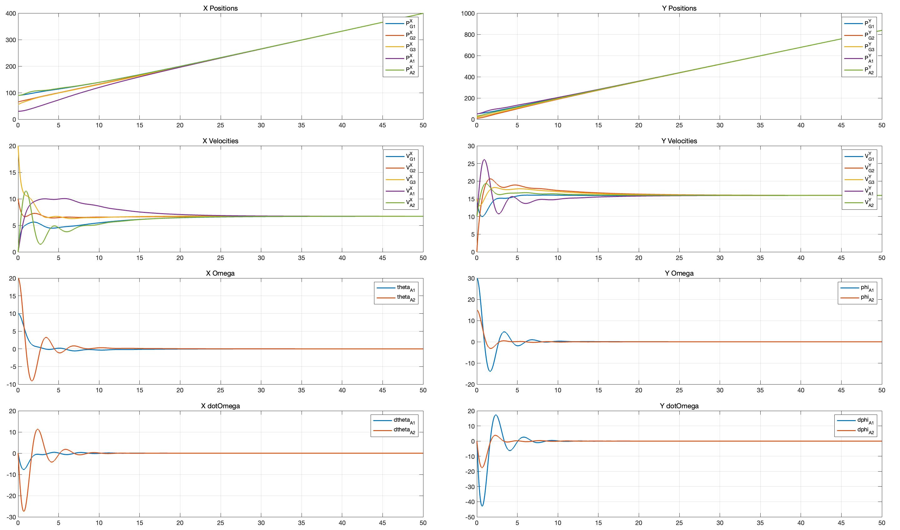
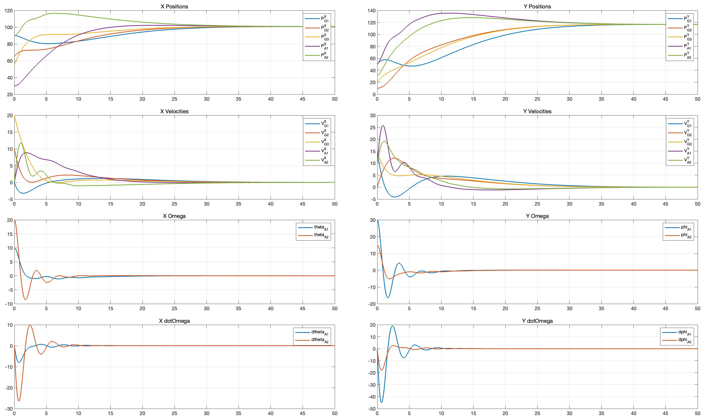

# Consensus_of_Heterogeneous_Mixed-order_Multi-agent_Systems_including_UGV_and_UAV
Consensus of Heterogeneous Mixed-order Multi-agent Systems including UGV and UAV 
包括UGV和UAV在内的异构混合阶多智能体系统的一致性

动态和静态一致性结果的验证，可以通过调整代码中第 56 行的 protocol 参数来验证

# Dynamic Consensus

# Static Consensus

